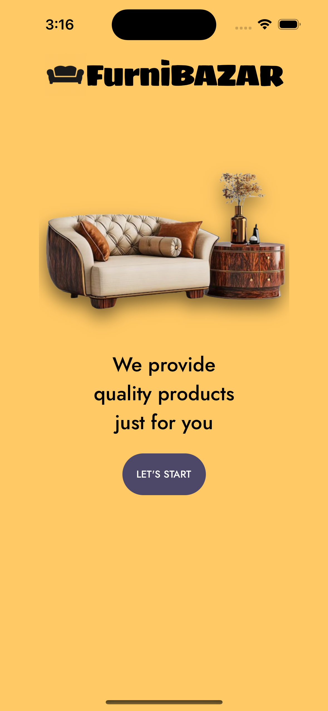
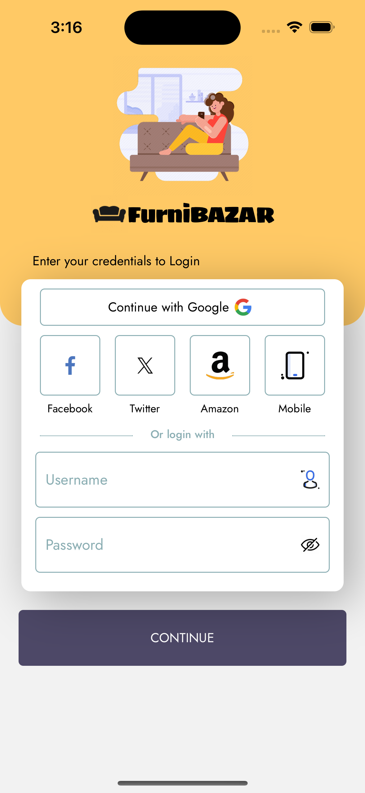
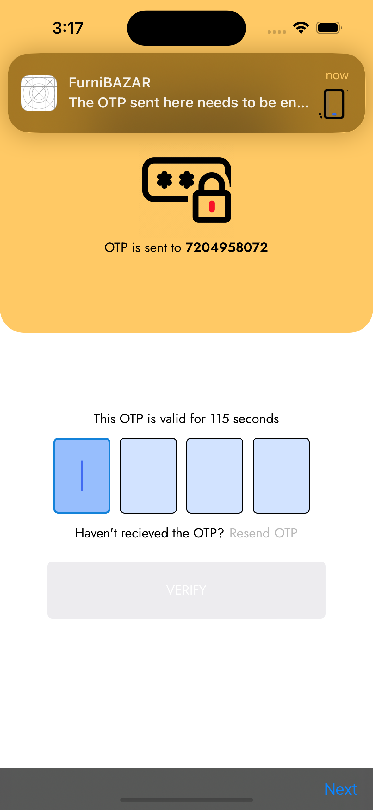
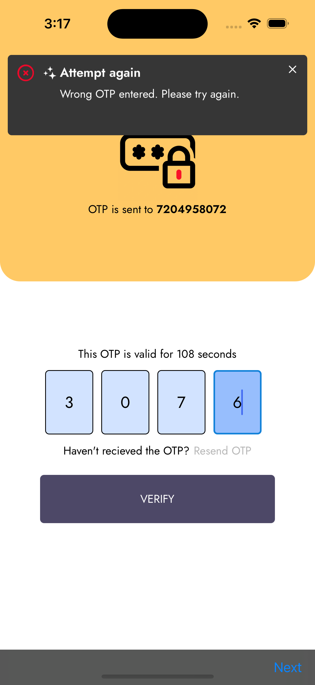
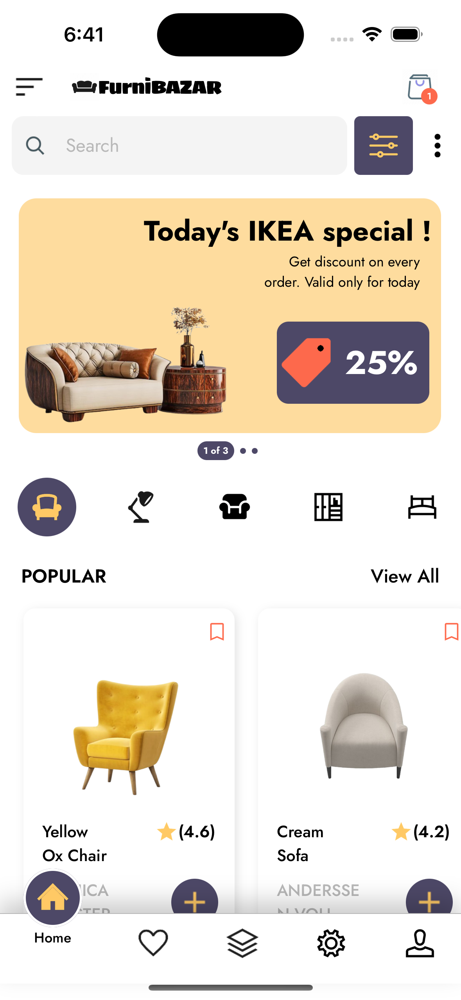
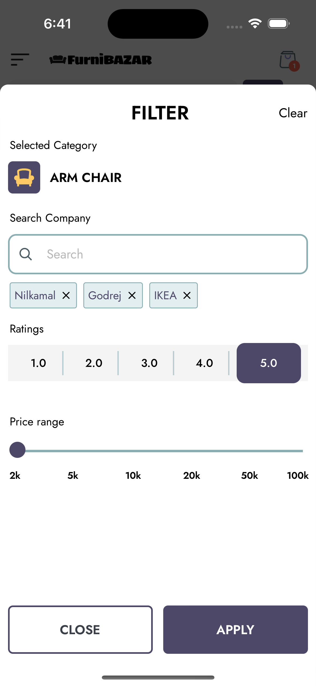

# 🛋️ FurnitureApp

A sleek React Native app to browse and manage modern furniture collections.  
Built with love using React Native, TypeScript, and modern UI components.


---

## ✨ Features

- 🔍 Browse premium furniture collections
- ❤️ Add to favorites
- 🔔 Push notifications

---
## ✨ Upcoming Features

- 🛒 Add to favorites and cart
- 📦 View detailed product info
- 🌙 Dark mode support

---

## 🛠 Tech Stack

| Technology                                                                                                      | Description                     |
| --------------------------------------------------------------------------------------------------------------  | ------------------------------- |
|                                         | React Native                    |
|                                           | TypeScript                      |
|                     | VS Code                         |
|                               | Android Studio                  |
|         | XCode                           |
|                                      | Notifee (Notifications)         |
|    | Firebase (Authentication)       |

---

## 📲 Screenshots

<table>
  <tr>
    <th>Landing Screen</th>
    <th>Login Detail</th>
    <th>Login Detail 2</th>
    <th>OTP Screen</th>
    <th>OTP Error Screen</th>
    <th>Home Screen</th>
    <th>Filter Modal</th>
  </tr>
  <tr>
    <td></td>
    <td></td>
    <td></td>
    <td></td>
    <td></td>
    <td></td>
    <td></td>
  </tr>
</table>
---

## 🚀 Getting Started

```bash
# Clone the repo
git clone https://github.com/PSSubramanya/furniBAZAR.git

# Install dependencies
npm install

# Run on Android
npx react-native run-android

# Run on iOS
npx react-native run-ios
```
